# Tài liệu tổng thể hệ thống MaiHub

> Tài liệu mô tả hệ thống theo mã nguồn tại repository này, không phải cam kết về môi trường production. Những nội dung chỉ suy ra từ mã nhưng chưa được chạy kiểm chứng được gắn nhãn **Cần xác nhận vận hành**.

## 0. Kiểm soát tài liệu

| Thuộc tính | Giá trị |
|---|---|
| Tên hệ thống | MaiHub (trước 26.9.0: MaiHub) |
| Phiên bản ứng dụng được khảo sát | `26.8.5` |
| Phiên bản tài liệu | `1.0` |
| Ngày lập | 2026-09-18 |
| Trạng thái | Baseline theo mã nguồn nhánh hiện tại |
| Chủ sở hữu | Maiychrus (dự án cá nhân) |
| Độc giả | Ban vận hành, BA/PM, đội CNTT, phát triển, kiểm thử, hỗ trợ người dùng |
| Nguồn sự thật | Mã nguồn, cấu hình build và tài liệu nội bộ trong repository |

### 0.1 Phạm vi

Tài liệu bao phủ ứng dụng desktop MaiHub: kiến trúc Electron/React, IPC, các dịch vụ nghiệp vụ, SQLite, bridge Go cho Facebook E2EE, các module Chat, CRM, ERP, Workflow, AI, Integrations và Workspace; đồng thời mô tả chức năng, phân quyền, giao diện chính, dữ liệu, tích hợp, bảo mật, vận hành và bộ 15 sản phẩm BA.

Ngoài phạm vi:

- Hạ tầng hoặc SLA thực tế của từng nhà cung cấp bên ngoài.
- Quy trình nghiệp vụ chưa có dấu vết trong repository.
- Kết quả tải, bảo mật xâm nhập, UAT hoặc tương thích thiết bị thực tế. Các mục này được ghi **Cần xác nhận vận hành**.
- Cấu trúc nội bộ của thư mục sinh tự động/vendor `src/bridge-e2ee/build` và `src/bridge-e2ee/meta`.

### 0.2 Nguyên tắc đọc

| Nhãn | Ý nghĩa |
|---|---|
| Xác nhận từ mã nguồn | Có cấu trúc, kiểu dữ liệu, nhánh xử lý hoặc cấu hình tương ứng trong repository |
| Cần xác nhận vận hành | Mã cho thấy chủ đích nhưng chưa có bằng chứng chạy thật/UAT trong phạm vi khảo sát |
| Khoảng trống | Chưa đủ bằng chứng để xem là năng lực đã bàn giao |

## 1. Tổng quan hệ thống

MaiHub là ứng dụng desktop nội bộ, hợp nhất vận hành nhiều tài khoản Zalo, Facebook và Telegram với CRM, ERP, workflow tự động, trợ lý AI và tích hợp nghiệp vụ. Renderer chạy React; Electron main process nắm quyền hệ điều hành, kết nối kênh, IPC và dữ liệu; SQLite lưu dữ liệu cục bộ trong thư mục `userData` của ứng dụng.

Các chế độ vận hành được mã hóa gồm:

- `standalone`: một máy vận hành độc lập.
- `boss`: máy chủ nội bộ giữ kết nối tài khoản và relay cho nhân viên.
- `employee`: workspace từ xa kết nối máy boss, không tự giữ kết nối Zalo trực tiếp.

Một cài đặt hỗ trợ tối đa 5 workspace loại `local` hoặc `remote`. Workspace mặc định trỏ tới `ahv-connect-tool.db`; workspace bổ sung có database và thư mục media riêng. Nguồn: `src/utils/AppModeManager.ts`, `src/utils/WorkspaceManager.ts`.

### 1.1 Mục tiêu nghiệp vụ

1. Giảm số ứng dụng/tab mà nhân viên cần dùng để chăm sóc liên hệ.
2. Chuẩn hóa chat đa kênh và lưu dấu vết tương tác cục bộ.
3. Quản lý liên hệ, nhãn, ghi chú và chiến dịch gửi tin.
4. Quản lý công việc, lịch, ghi chú và nhân sự nội bộ.
5. Tự động hóa phản hồi và kết nối dữ liệu với AI, POS, thanh toán, vận chuyển.
6. Phân tách dữ liệu/quyền truy cập theo workspace, nhân viên, tài khoản và vai trò ERP.

### 1.2 Thuật ngữ miền nghiệp vụ

| Thuật ngữ | Định nghĩa trong hệ thống |
|---|---|
| Account | Tài khoản kênh Zalo/Facebook/Telegram được ứng dụng quản lý |
| Conversation/Thread | Cuộc hội thoại với một liên hệ hoặc nhóm |
| Contact | Cá nhân/nhóm được đồng bộ hoặc quản lý trong Chat/CRM |
| Campaign | Đợt thực hiện gửi tin, kết bạn, mời nhóm hoặc tổ hợp hành động tới danh sách liên hệ |
| Workflow | Đồ thị node/edge gồm trigger, xử lý và hành động đầu ra |
| Workflow run | Một lần thực thi workflow, có trạng thái, kết quả từng node và lỗi |
| Integration | Cấu hình adapter kết nối POS, thanh toán, vận chuyển hoặc Telegram Bot |
| Workspace local | Không gian dữ liệu cục bộ; có thể bật relay để làm máy boss |
| Workspace remote | Không gian nhân viên kết nối máy boss qua URL/token và có cache cục bộ |
| Boss | Actor quản trị kết nối, nhân viên và dữ liệu chia sẻ |
| Employee | Nhân viên đăng nhập workspace remote, bị giới hạn module và tài khoản được gán |
| ERP role | Vai trò `owner`, `admin`, `manager`, `member` hoặc `guest` dùng cho quyền hành động ERP |
| Project | Nhóm công việc ERP, có trạng thái active/archived |
| Task | Công việc ERP có trạng thái, ưu tiên, người thực hiện, checklist, bình luận và tệp |
| Relay | Dịch vụ HTTP/socket trên máy boss để workspace nhân viên truy cập dữ liệu/hành động |
| Bridge E2EE | Tiến trình Go giao tiếp JSON-line qua stdin/stdout để xử lý Facebook Messenger E2EE |

## 2. Kiến trúc hệ thống

### 2.1 Sơ đồ thành phần

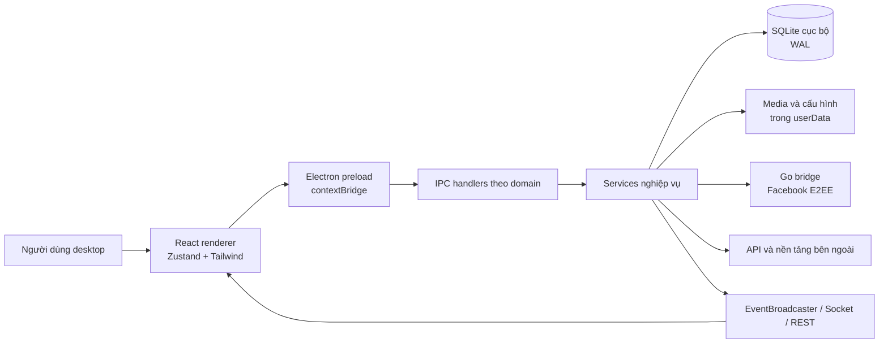

### 2.2 Trách nhiệm theo lớp

| Lớp | Trách nhiệm | Nguồn chính |
|---|---|---|
| Renderer | Điều hướng, màn hình, store UI, responsive desktop/mobile, nhận sự kiện | `src/ui/App.tsx`, `src/ui/components/layout/Sidebar.tsx`, `src/ui/store/` |
| Preload | Chỉ công khai API được định nghĩa qua `contextBridge`, chuyển lời gọi thành IPC | `electron/preload.ts` |
| IPC | Validation/ủy quyền tại biên main process, điều phối service theo domain | `electron/ipc/` |
| Services | Kết nối kênh, CRM queue, workflow engine, AI, ERP, integrations, relay | `src/services/` |
| Persistence | Schema/migration/truy vấn SQLite; cấu hình và media cục bộ | `src/services/database/DatabaseService.ts`, `src/services/file/FileStorageService.ts` |
| Facebook E2EE | Binary Go độc lập, RPC JSON-line, phát sự kiện bất đồng bộ | `src/bridge-e2ee/README.md`, `src/bridge-e2ee/main.go` |
| Build/runtime | Tạo BrowserWindow, lifecycle, startup, đóng gói đa nền tảng | `electron/main.ts`, `package.json`, `scripts/` |

### 2.3 Ranh giới tin cậy

- Renderer không có Node.js trực tiếp (`nodeIntegration: false`) và chạy với `contextIsolation: true`.
- Preload là hợp đồng duy nhất được renderer sử dụng để gọi quyền main process.
- IPC/service là biên cần kiểm tra input và quyền; riêng ERP dùng `ErpAuthContext` để suy ra actor phía main, không tin `employeeId` do renderer gửi.
- SQLite, file/media và credential nằm trên máy; an toàn phụ thuộc quyền tài khoản hệ điều hành và cơ chế mã hóa của OS.
- API/webhook/tunnel và nền tảng chat là biên ngoài không tin cậy.

Lưu ý: BrowserWindow hiện đặt `sandbox: false`; CSP production tồn tại nhưng cho phép ảnh/media/connect qua `http:`, `https:` và `wss:` để hỗ trợ CDN/API. Đây là bề mặt cần được security review định kỳ. Nguồn: `electron/main.ts`.

## 3. Luồng khởi động và luồng dữ liệu

### 3.1 Luồng khởi động

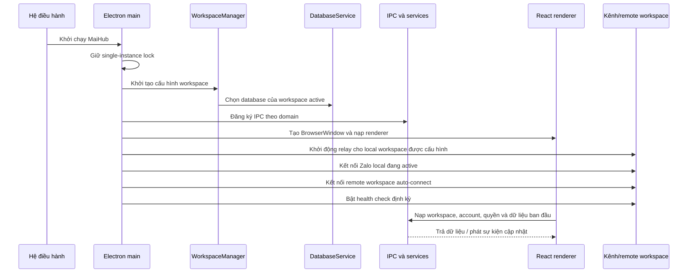

Thứ tự `startupAllWorkspaces` là: relay local trước, kết nối Zalo local sau, rồi mới kết nối workspace remote để máy boss sẵn sàng trước employee. **Cần xác nhận vận hành** về thời gian khởi động, phục hồi mạng và hành vi khi nhiều workspace cùng lỗi. Nguồn: `electron/main.ts`.

### 3.2 Luồng chat và lưu dữ liệu

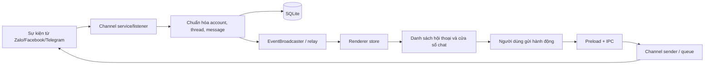

### 3.3 Luồng workflow

Trigger tin nhắn, lịch, webhook, thanh toán hoặc thao tác thủ công gọi `executeWorkflow`. Engine sắp xếp đồ thị, thực thi node, dùng queue gửi theo account, gọi IntegrationRegistry khi cần, lưu `workflow_run_logs` và phát sự kiện. Node hiện bao phủ Zalo/Facebook/Telegram, logic/dữ liệu, Google Sheets, AI, HTTP, email/Discord/Notion, POS, thanh toán và vận chuyển. Nguồn: `src/services/workflow/WorkflowEngineService.ts`.

### 3.4 Luồng workspace employee

Workspace remote lưu URL boss, token, employee identity và cache quyền/account. Renderer khởi tạo REST accessor sớm, sau đó nhận dữ liệu/sự kiện từ boss; các hành động nhạy cảm vẫn phải được kiểm tra phía main/server. **Cần xác nhận vận hành** về reconnect, xung đột cache và hành vi offline. Nguồn: `src/utils/WorkspaceManager.ts`, `src/services/http/`, `src/ui/App.tsx`.

## 4. Mô tả module

### 4.1 Chat đa kênh

- Quản lý nhiều account, chuyển account và hội thoại.
- Nhận/gửi tin nhắn, ảnh, file, voice và các hành động phụ thuộc khả năng từng kênh.
- Hỗ trợ reply, reaction, ghim, nhãn, draft, quick message, tìm kiếm và thông báo.
- Zalo dùng `zca-js`; Telegram có user và bot; Facebook có service thường và bridge E2EE.
- UI hợp nhất trải nghiệm nhưng capability thực tế khác nhau theo kênh; cần kiểm tra `CRMChannelCapabilityService` và handler kênh trước khi cam kết một hành động.

Nguồn: `src/services/zalo/`, `src/services/facebook/`, `src/services/telegram/`, `src/ui/components/chat/`.

### 4.2 CRM

- Danh bạ/liên hệ, tag, note, yêu cầu kết bạn và dữ liệu quét Facebook.
- Campaign loại `message`, `friend_request`, `mixed`, `invite_to_group`.
- Contact trong campaign đi qua `pending`, `sending`, `sent`, `failed`.
- Queue áp dụng token bucket, khoảng delay, giờ bắt đầu ngày và giới hạn gửi/ngày khi được cấu hình.
- Form cho phép nhập delay tùy chỉnh từ 5 giây, nhưng queue ép `MIN_DELAY_MS = 30 giây`; vì vậy delay hiệu lực giữa hai contact không thấp hơn 30 giây. Preset 5–15 giây hiện không phản ánh thời gian gửi thực tế.
- Kênh campaign được snapshot trên bản ghi mới; bản ghi cũ có fallback về channel của account.

Chênh lệch tài liệu: README/NOTICE ghi chưa có giới hạn ngày/giờ im lặng, nhưng model, UI và `CRMQueueService` hiện có `daily_send_limit` và `daily_start_time`, đồng thời thực thi hai kiểm tra này. Thực tế mã nguồn được ưu tiên; README/NOTICE cần được hòa giải. `daily_start_time` là giờ bắt đầu, không phải một khoảng “quiet hours”; chưa thấy cơ chế opt-out thống nhất. **Cần xác nhận vận hành** trước khi gửi cho học viên thật.

Nguồn: `src/models/crm.ts`, `src/services/crm/CRMQueueService.ts`, `src/ui/components/crm/campaigns/CampaignCreateModal.tsx`.

### 4.3 ERP

- Dự án và task Kanban/inbox; task có assignee, watcher, checklist, comment, attachment, dependency, activity log.
- Lịch cá nhân/đội nhóm và reminder.
- Ghi chú, thư mục, tag, phiên bản và chia sẻ.
- Hồ sơ nhân sự, phòng ban, chức vụ, chấm công và nghỉ phép.
- Thông báo và báo cáo ERP.
- Hai tầng quyền: module employee và action-level ERP role/override.

Nguồn: `src/models/erp/`, `src/services/erp/`, `electron/ipc/erp*`, `src/ui/features/erp/`.

### 4.4 Workflow

- Danh sách, template store, import/export JSON, editor React Flow và chạy thử.
- Workflow có kênh, danh sách account áp dụng, node, edge, cờ enabled và log chạy.
- Trigger gồm message, friend request, group event, reaction, undo, schedule, manual, label, webhook, payment và trigger theo Facebook/Telegram.
- Action gồm chat, logic, transform dữ liệu, Sheets, AI, notification, HTTP, POS, thanh toán, vận chuyển.
- Run có `success`, `error`, `partial`; node có `success`, `error`, `skipped`.

Nguồn: `src/models/workflow.ts`, `src/services/workflow/WorkflowEngineService.ts`, `src/ui/components/workflow/`.

### 4.5 AI Assistant

- Quản lý assistant, file, hội thoại, message, usage log và liên kết assistant theo account.
- Hỗ trợ provider cấu hình theo kiểu OpenAI-compatible và provider tùy chỉnh; assistant có thể dùng trực tiếp hoặc từ workflow.
- API key/endpoint/model là dữ liệu nhạy cảm và phụ thuộc nhà cung cấp.
- **Cần xác nhận vận hành** về model thực có quyền truy cập, chi phí, quota, lưu trữ dữ liệu tại provider và chất lượng đầu ra.

Nguồn: `src/services/ai/AIAssistantService.ts`, `src/models/ai.ts`, `src/ui/components/integration/AIAssistantPage.tsx`.

### 4.6 Integrations

Registry hiện tạo adapter cho:

| Nhóm | Hệ thống |
|---|---|
| POS/bán hàng | KiotViet, Haravan, Sapo, Nhanh, Pancake |
| Thanh toán | Casso, SePay |
| Vận chuyển | GHN, GHTK |
| Tin nhắn | Telegram Bot |

Credential được mã hóa bằng Electron `safeStorage` khi OS hỗ trợ và bị mask khi trả về UI. Registry có server webhook nhúng, mặc định port 9888, route theo integration ID/type. Chữ ký request được đọc và phát trong event nhưng `IntegrationRegistry` chưa xác minh chữ ký; từng adapter hoặc lớp biên phải bổ sung/kiểm chứng trước khi public webhook. Không bật public tunnel nếu chưa có xác thực, allowlist và giám sát.

Nguồn: `src/services/integrations/IntegrationRegistry.ts`, `src/services/integrations/adapters/`, `src/ui/components/integration/IntegrationPage.tsx`.

### 4.7 Workspace và nhân viên

- Tạo/sửa/xóa/chuyển workspace; workspace mặc định không được xóa và hệ thống phải còn ít nhất một workspace.
- Local workspace có DB, relay port và auto-start; remote workspace có boss URL, token, employee và auto-connect.
- Quản lý employee/group, mật khẩu băm, trạng thái active, quyền module và account được gán.
- Cache remote giữ quyền/account/profile để UI có dữ liệu trước khi đồng bộ.
- Tối đa 5 workspace là ràng buộc mã hiện tại.

Nguồn: `src/utils/WorkspaceManager.ts`, `src/models/employee.ts`, `src/services/employee/EmployeeService.ts`, `electron/ipc/workspaceIpc.ts`, `electron/ipc/employeeIpc.ts`.

### 4.8 Dashboard, Analytics và Settings

- Dashboard tổng hợp trạng thái và lối tắt nghiệp vụ.
- Analytics/Báo cáo hiển thị số liệu hoạt động và KPI nhân viên.
- Settings gồm hội thoại, giao diện, thông báo, tài khoản, proxy, bảo mật, webhooks, nhân viên, workspace, lưu trữ, giới thiệu, log phiên bản và nhật ký.
- **Cần xác nhận vận hành** về định nghĩa KPI, chu kỳ tổng hợp và đối soát báo cáo với dữ liệu nguồn.

Nguồn: `src/ui/components/dashboard/`, `src/ui/components/analytics/`, `src/ui/components/settings/Settings.tsx`.

### 4.9 Trình duyệt (Browser Profiles)

- Mỗi profile là một trình duyệt Chromium antidetect riêng (nhân `fingerprint-chromium` 148.0.7778.215) với fingerprint cố định, thư mục dữ liệu riêng và proxy riêng lấy từ kho proxy hiện có.
- Nhân trình duyệt không nằm trong bộ cài; người dùng tải lần đầu (khoảng 190 MB), có kiểm SHA-256, lưu tại `<userData>/browser-engine/`.
- Profile có proxy đi qua một proxy chuyển tiếp cục bộ trên `127.0.0.1` do main process chạy; proxy lỗi thì trình duyệt nhận `502`, không chuyển sang kết nối trực tiếp.
- Tối đa 30 profile mở đồng thời. Trạng thái đang chạy chỉ nằm trong bộ nhớ.
- Chỉ dùng được ở chế độ Boss/Standalone, trên Windows và Linux. Persona luôn trùng hệ điều hành máy thật.
- Dữ liệu trình duyệt (cookie, phiên đăng nhập) nằm tại `<thư mục DB của workspace>/browser-profiles/<id>/` và **chưa được mã hóa**.
- Chuyển workspace hoặc thoát app sẽ đóng mọi profile đang mở.

Nguồn: `src/services/browser/`, `electron/ipc/browserProfileIpc.ts`, `src/ui/features/browser/`, `src/configs/browserEngine.config.ts`, `docs/plans/2026-10-01-browser-profiles.md`.

## 5. Mô hình dữ liệu theo nhóm

SQLite được bật WAL trong `DatabaseService`. Thay vì liệt kê mọi cột, bảng dưới nhóm các aggregate chính và quan hệ nghiệp vụ.

| Nhóm | Bảng/đối tượng tiêu biểu | Quan hệ chính |
|---|---|---|
| Account và chat | `accounts`, `messages`, `contacts`, `friends`, `friend_requests`, `links` | Account sở hữu conversation/contact/message theo kênh |
| Telegram | `telegram_peers`, `telegram_update_state`, `telegram_channel_pts`, `telegram_bot_cursor` | Theo dõi peer và cursor/update state |
| Facebook | `fb_accounts`, `fb_threads`, `fb_messages`, `fb_crm_contacts` | Account Facebook liên kết thread/message/contact |
| Chat tiện ích | `message_drafts`, `pinned_messages`, `local_pinned_conversations`, `local_quick_messages`, labels/stickers | Metadata cục bộ gắn account/thread/message |
| CRM | `crm_tags`, `crm_contact_tags`, `crm_notes`, `crm_campaigns`, `crm_campaign_contacts`, `crm_send_log` | Campaign có nhiều contact; log ghi kết quả gửi |
| Employee | `employees`, `employee_groups`, `employee_permissions`, `employee_account_access`, `employee_sessions`, `employee_message_log` | Employee thuộc group, có module permission và account assignment |
| ERP Task | `erp_projects`, `erp_tasks`, assignees/watchers/checklist/comments/attachments/dependencies/activity | Project chứa task; task có nhiều thành phần cộng tác |
| ERP Calendar/Notes | events/attendees/reminders; notes/folders/tags/shares/versions | Event và note có quan hệ nhiều-người/nhiều-tag |
| ERP HRM | `erp_departments`, `erp_positions`, `erp_employee_profiles`, `erp_attendance`, `erp_leave_requests` | Profile liên kết employee, phòng ban, chức vụ và quản lý |
| AI | assistants/files/account links/conversations/messages/usage logs | Assistant phục vụ account và hội thoại, có log sử dụng |
| Workflow | `workflows`, `workflow_run_logs` | Workflow lưu node/edge JSON; run lưu kết quả node |
| Integrations | `integrations` | Credential mã hóa và settings JSON theo adapter |
| Hệ thống | `app_settings`, `proxies`, `bank_cards` | Cấu hình cục bộ và dữ liệu hỗ trợ |

### 5.1 Dữ liệu và vòng đời

- Database và media nằm trong Electron `userData`; thư mục là `MaiHub`. Lần đầu chạy 26.9.0, thư mục `MaiHub` cũ được đổi tên thành `MaiHub` (`src/services/app/legacyDataMigration.ts`); trên Linux/macOS dữ liệu mã hóa bằng `safeStorage` không giải mã được sau khi đổi tên app nên phải đăng nhập lại.
- Dữ liệu cũ không tự chuyển sang thư mục MaiHub. Có hướng dẫn copy khi app đã tắt trong `NOTICE.md`; **Cần xác nhận vận hành** trên từng OS trước khi di trú thật.
- Chưa có backup tự động được mô tả trong mã/tài liệu hiện hành; vận hành phải sao lưu database, config và media trước nâng cấp.
- Tên tệp `ahv-connect-tool.db` và một số khóa `ahv-connect_*` được giữ để tương thích.

## 6. Sản phẩm BA 1 — Sơ đồ BPMN mức nghiệp vụ

Quy trình mẫu xuyên hệ thống: tiếp nhận và xử lý yêu cầu học viên qua chat, có thể cập nhật CRM, tạo task hoặc kích hoạt tự động hóa.

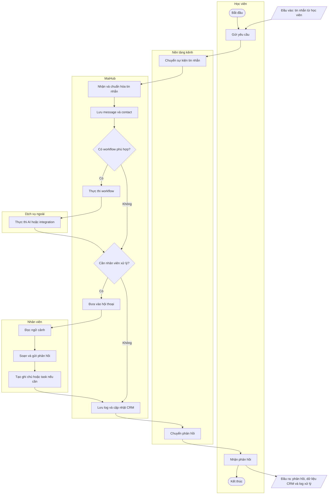

Quy tắc quan trọng: chỉ gửi hành động mà kênh hỗ trợ; quyền employee/account phải hợp lệ; kết quả workflow/integration phải được log; dữ liệu nhạy cảm không đưa vào log không cần thiết.

## 7. Sản phẩm BA 2 — Swimlane workflow theo đối tượng Campaign

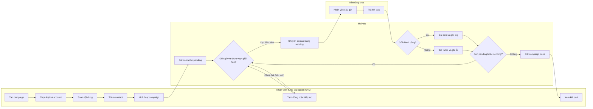

## 8. Sản phẩm BA 3 — Biểu đồ trạng thái

### 8.1 Campaign

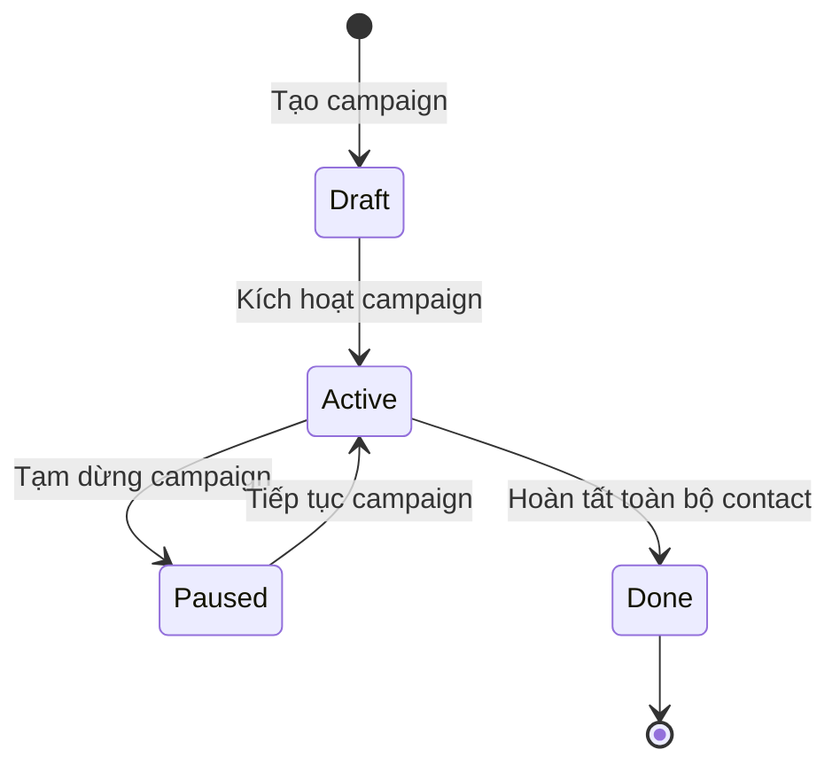

### 8.2 Contact trong campaign

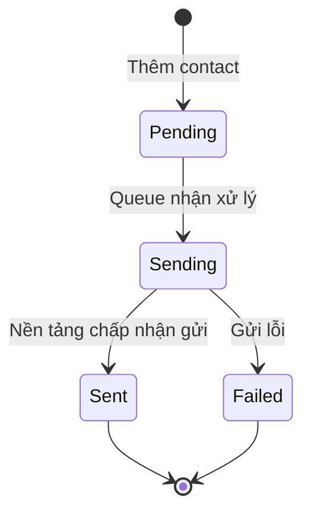

### 8.3 ERP Task

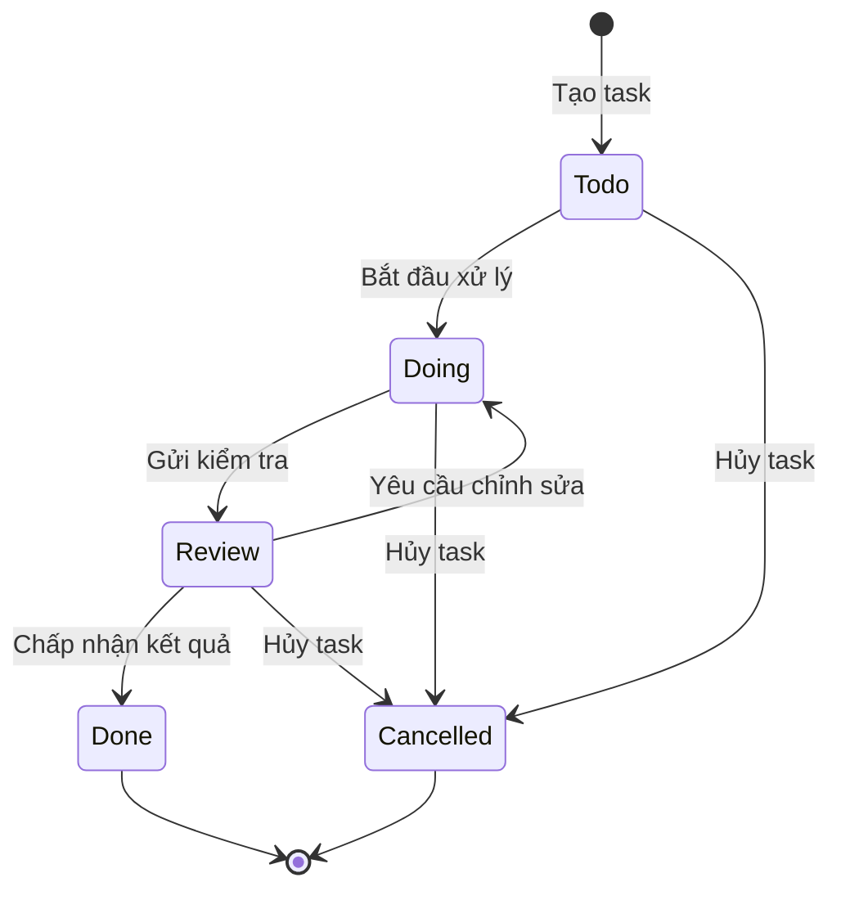

Các chuyển trạng thái campaign cần **Cần xác nhận vận hành** bằng UAT để bảo đảm pause/resume, hoàn tất và trạng thái contact khớp giữa UI, queue và database.

## 9. Sản phẩm BA 4 — Danh sách chức năng

`Size` là ước lượng BA tương đối, không phải estimate cam kết. `Phase` phản ánh mã hiện có.

| Trace code | Data object | Module | Function | Size | Type | Description / Objective / Remarks | Phase |
|---|---|---|---|---|---|---|---|
| FN-AUTH-01 | Account | Authentication | Đăng nhập tài khoản kênh | L | Workflow | QR/cookie/auth/session tùy kênh | Hiện có |
| FN-AUTH-02 | Employee | Authentication | Đăng nhập workspace employee | M | Workflow | Kết nối boss và nạp quyền/account | Hiện có |
| FN-CHAT-01 | Conversation | Chat | Xem danh sách hội thoại | M | Basic | Hợp nhất theo account/kênh | Hiện có |
| FN-CHAT-02 | Message | Chat | Gửi và nhận tin nhắn | L | Workflow | Text/media/action theo capability kênh | Hiện có |
| FN-CHAT-03 | Message | Chat | Reply, reaction, ghim và thu hồi | L | Other | Không đồng nhất giữa các kênh | Hiện có |
| FN-CHAT-04 | Conversation | Chat | Tìm kiếm và lọc hội thoại | M | Basic | Tìm kiếm cục bộ/remote theo mode | Hiện có |
| FN-CHAT-05 | Template | Chat | Quản lý quick message và label | M | Basic | CRUD nội dung dùng lại/phân loại | Hiện có |
| FN-CRM-01 | Contact | CRM | Quản lý contact, tag và note | M | Basic | Danh sách, chi tiết, phân loại, ghi chú | Hiện có |
| FN-CRM-02 | Campaign | CRM | Tạo và cấu hình campaign | L | Workflow | Loại, nội dung, delay, giới hạn ngày/giờ bắt đầu | Hiện có |
| FN-CRM-03 | CampaignContact | CRM | Thêm và theo dõi contact campaign | M | Workflow | Theo dõi pending/sending/sent/failed | Hiện có |
| FN-CRM-04 | SendLog | CRM | Xem log gửi và lỗi | M | Reporting | Phục vụ theo dõi và đối soát | Hiện có |
| FN-CRM-05 | Scan data | CRM | Quét/tổng hợp dữ liệu Facebook | L | Advanced | Phụ thuộc API không chính thức | Hiện có/rủi ro |
| FN-ERP-01 | Project | ERP | Quản lý dự án | M | Basic | Tạo, sửa, xóa, lưu trữ theo quyền | Hiện có |
| FN-ERP-02 | Task | ERP | Quản lý task cộng tác | L | Workflow | Kanban/inbox, assignee, watcher, checklist, comment, file | Hiện có |
| FN-ERP-03 | CalendarEvent | ERP | Quản lý lịch cá nhân và nhóm | L | Workflow | Attendee, reminder, quyền theo vai trò | Hiện có |
| FN-ERP-04 | Note | ERP | Quản lý và chia sẻ note | L | Workflow | Folder, tag, version, share | Hiện có |
| FN-ERP-05 | EmployeeProfile | ERP | Quản lý hồ sơ, phòng ban, chức vụ | L | Basic | RBAC owner/admin/manager/member/guest | Hiện có |
| FN-ERP-06 | Attendance | ERP | Check-in/check-out và tra cứu | M | Workflow | Có quyền xem người khác riêng | Hiện có |
| FN-ERP-07 | LeaveRequest | ERP | Tạo và duyệt nghỉ phép | M | Workflow | pending/approved/rejected/cancelled | Hiện có |
| FN-WF-01 | Workflow | Workflow | Thiết kế workflow node/edge | XL | Advanced | React Flow; nhiều loại trigger/action | Hiện có |
| FN-WF-02 | Workflow | Workflow | Import, export, clone và template | M | Other | JSON có khóa nhận dạng tương thích | Hiện có |
| FN-WF-03 | WorkflowRun | Workflow | Chạy thử, thực thi và xem log | L | Workflow | success/error/partial; kết quả từng node | Hiện có |
| FN-AI-01 | Assistant | AI | Quản lý AI assistant | L | Basic | Provider, model, prompt, file/account binding | Hiện có |
| FN-AI-02 | AIConversation | AI | Dùng AI trong chat/workflow | L | Workflow | Phụ thuộc provider và quota | Hiện có |
| FN-INT-01 | Integration | Integrations | Cấu hình và test adapter | L | Workflow | Credential động theo catalog | Hiện có |
| FN-INT-02 | Webhook | Integrations | Nhận webhook thanh toán/tích hợp | L | Workflow | Server local; chữ ký cần hardening | Hiện có/rủi ro |
| FN-WS-01 | Workspace | Workspace | Quản lý và chuyển workspace | L | Basic | Local/remote; tối đa 5 | Hiện có |
| FN-EMP-01 | Employee | Employee | Quản lý nhân viên và nhóm | L | Basic | Mật khẩu, trạng thái, group | Hiện có |
| FN-EMP-02 | Permission | Employee | Gán module và account | L | Workflow | Hạn chế view/action theo nhân viên | Hiện có |
| FN-AN-01 | Metrics | Analytics | Xem dashboard, báo cáo và KPI | L | Reporting | Cần UAT định nghĩa số liệu | Hiện có |
| FN-NOTI-01 | Notification | System | Xem thông báo/nhắc việc | M | Other | Desktop/in-app/ERP notification | Hiện có |
| FN-SET-01 | Setting | Settings | Cấu hình ứng dụng | L | Basic | Giao diện, hội thoại, proxy, bảo mật, lưu trữ, log | Hiện có |
| FN-OPS-01 | Log | Operations | Xem nhật ký hỗ trợ | S | Other | Điểm thu thập thông tin khi báo lỗi | Hiện có |

Rà soát chức năng phổ biến:

- Có đăng nhập kênh và employee; không coi tự đăng ký/quên mật khẩu end-user là năng lực hiện hành nếu chưa có yêu cầu và UAT tương ứng.
- Có thông báo, dashboard, báo cáo, settings, quản lý nhân viên/tài khoản.
- Hồ sơ ERP có xem/cập nhật; “xác minh tài khoản” chưa được xem là chức năng nghiệp vụ độc lập.
- **Cần xác nhận vận hành** cho mọi khoảng trống trên trước khi đưa vào roadmap.

## 10. Sản phẩm BA 5 — Ma trận phân quyền

### 10.1 Danh sách actor

| STT | Actor Name | Description |
|---:|---|---|
| 1 | Boss/Standalone | Chủ máy hoặc vận hành độc lập; được ánh xạ ERP owner |
| 2 | Employee | Nhân viên remote, có module permission và account assignment |
| 3 | ERP Owner | Toàn quyền cơ sở ERP theo ma trận mặc định |
| 4 | ERP Admin | Quản trị ERP, trừ các giới hạn được mã hóa |
| 5 | ERP Manager | Quản lý đội/việc, không có một số quyền hệ thống/xóa dự án |
| 6 | ERP Member | Thực hiện công việc cá nhân/được giao |
| 7 | ERP Guest | Chỉ truy cập/xem lịch ở mức rất hạn chế |
| 8 | Nền tảng ngoài | Zalo/Facebook/Telegram/API/webhook; không phải user nội bộ |

### 10.2 Quyền module employee

| Function | Boss/Standalone | Employee |
|---|:---:|:---:|
| Truy cập Chat | O | O* |
| Truy cập Bạn bè | O | O* |
| Truy cập CRM | O | O* |
| Truy cập Workflow | O | O* |
| Truy cập Tích hợp | O | O* |
| Truy cập Analytics | O | O* |
| Truy cập AI Assistant | O | O* |
| Truy cập Settings | O | O* |
| Thao tác trên account cụ thể | O | O* |

`O*`: Employee cần `can_access` cho module tương ứng và chỉ được dùng account đã gán. App có guard view; enforcement thực tế phải được kiểm tra thêm tại IPC/service cho từng hành động. Mã `ALL_MODULES` chưa liệt kê `erp`, trong khi renderer có kiểm tra key `erp`; quyền ERP action được điều khiển riêng bằng ERP role. Đây là điểm cần thống nhất mô hình quyền.

### 10.3 Quyền ERP mặc định

| Function | Owner | Admin | Manager | Member | Guest |
|---|:---:|:---:|:---:|:---:|:---:|
| Truy cập ERP | O | O | O | O | O |
| Tạo dự án | O | O | O | X | X |
| Cập nhật dự án | O | O | O | X | X |
| Xóa dự án | O | O | X | X | X |
| Lưu trữ dự án | O | O | O | X | X |
| Tạo task | O | O | O | O | X |
| Cập nhật task | O | O | O | O* | X |
| Tự nhận task | O | O | O | O | X |
| Giao task cho người khác | O | O | O | X | X |
| Sửa mọi task | O | O | O | X | X |
| Xóa task | O | O | O | X | X |
| Bình luận task | O | O | O | O | X |
| Xem lịch | O | O | O | O | O |
| Tạo lịch cá nhân | O | O | O | O | X |
| Tạo cuộc họp | O | O | O | X | X |
| Cập nhật lịch | O | O | O | O* | X |
| Xóa lịch | O | O | O | O* | X |
| Xem lịch đội nhóm | O | O | O | O | X |
| Tạo note | O | O | O | O | X |
| Cập nhật note | O | O | O | O* | X |
| Xóa note | O | O | O | O* | X |
| Chia sẻ note | O | O | O | O | X |
| Sửa note toàn workspace | O | O | X | X | X |
| Quản lý phòng ban | O | O | X | X | X |
| Quản lý chức vụ | O | O | X | X | X |
| Sửa hồ sơ của mình | O | O | O | O | X |
| Sửa hồ sơ người khác | O | O | O* | X | X |
| Xem nhân sự khác | O | O | O | O | X |
| Check-in/check-out | O | O | O | O | X |
| Xem chấm công người khác | O | O | O* | X | X |
| Tạo đơn nghỉ phép | O | O | O | O | X |
| Duyệt nghỉ phép | O | O | O* | X | X |
| Cài đặt ERP | O | O | X | X | X |

`O*`: ma trận action cho phép theo role, nhưng service còn phải giới hạn theo ownership/scope nghiệp vụ (task được giao, sự kiện/note của mình, nhân sự trực thuộc). Cần UAT các điều kiện này. Ngoài ra `extra_json.action_permissions` có thể `allow`/`deny` từng action cho một employee và được áp dụng trước ma trận role. Nguồn sự thật: `src/services/erp/permissions.ts`, `src/services/erp/ErpAuthContext.ts`.

## 11. Sản phẩm BA 6 — Tiêu chí UX và phân tích thiết kế

### 11.1 Người dùng và tác vụ

- Boss/IT cấu hình account, workspace, employee, integration và bảo mật; tần suất thấp nhưng rủi ro cao.
- Nhân viên chăm sóc dùng chat/CRM liên tục; cần tốc độ chuyển account/thread, trạng thái gửi rõ và tránh gửi nhầm.
- Quản lý dùng ERP/Analytics; cần lọc, tổng hợp, quyền và audit rõ.
- Người dùng có thể không có nền tảng kỹ thuật; credential/tunnel/bridge phải có cảnh báo bằng ngôn ngữ vận hành.

### 11.2 Tiêu chí UX

| Tiêu chí | Yêu cầu áp dụng |
|---|---|
| Chính trực | Hiển thị đúng account/kênh/workspace trước hành động gửi hoặc xóa; không giấu lỗi tích hợp |
| Giải pháp | Có retry/khôi phục mạng phù hợp, log lỗi và hướng dẫn tiếp theo |
| Kỳ vọng | Phân biệt rõ “đã lưu”, “đang gửi”, “đã gửi”, “thất bại”, “đã đồng bộ” |
| Đồng cảm | Cảnh báo nguy cơ spam/khóa tài khoản ngay khi cấu hình campaign |
| Cá nhân hóa | Hỗ trợ theme/font size, quick message, label, assistant và workspace |
| Thời gian/công sức | Giảm số bước đổi account, giữ draft, dùng phím tắt và preset |

### 11.3 Phân tích giao diện hiện tại

- Cấu trúc có sidebar, top bar và vùng nội dung; chat dùng layout nhiều panel; ERP dùng top navigation con.
- `App.tsx` đồng bộ theme lên `documentElement`, có nhánh mobile qua `useIsMobile`; nhiều component dùng class dark và một số class `dark:`.
- `DESIGN.md` là nguồn sự thật cho logo và cho hệ thiết kế của toàn bộ giao diện (ngôn ngữ macOS, token light/dark khớp với `src/ui/index.css`), áp dụng từ 02/10/2026.
- Màu trạng thái cần luôn có icon/text, không chỉ dựa vào màu; focus keyboard, contrast, screen reader label và responsive cần test thực.
- **Cần xác nhận vận hành** ở desktop và mobile cho dark/light mode, không overflow ngang, không chồng chữ, thao tác chính mượt, keyboard focus và trạng thái empty/loading/error.

## 12. Sản phẩm BA 7 — Mô tả màn hình

Các bảng dưới đặc tả màn hình trọng yếu. Các màn hình danh sách/chi tiết phụ tái sử dụng cùng quy tắc quyền, loading/error và định dạng dữ liệu.

### 12.1 Màn hình thêm tài khoản

| STT | Tên trường | Kiểu dữ liệu | Bắt buộc | Giá trị khởi tạo | Mô tả ràng buộc |
|---:|---|---|:---:|---|---|
| 1 | Kênh | Single choice | Có | Theo tab đang chọn | Zalo/Facebook/Telegram; phương thức đăng nhập thay đổi theo kênh |
| 2 | Phương thức đăng nhập | Single choice/tab | Có | Phương thức ưu tiên của kênh | QR, credential, cookie, auth JSON hoặc bot/user session tùy kênh |
| 3 | Tên đăng nhập | Free text | Có điều kiện | Rỗng | Email/số điện thoại với Telegram user |
| 4 | Mật khẩu | Password | Có điều kiện | Rỗng | Không hiển thị plaintext |
| 5 | Mã/secret 2FA | Password/free text | Có điều kiện | Rỗng | Chỉ hiện khi kênh yêu cầu |
| 6 | Cookie Facebook | Multiline text | Có điều kiện | Rỗng | Phải có cookie hợp lệ; dữ liệu nhạy cảm |
| 7 | Auth JSON Zalo | Multiline JSON | Có điều kiện | Rỗng | Cấu trúc gồm thông tin auth theo handler |
| 8 | Kết nối | Button | Không | Enabled khi đủ input | Hiển thị loading, success hoặc lỗi có thể xử lý |

Nguồn: `src/ui/components/auth/AddAccountModal.tsx`, `electron/ipc/loginIpc.ts`.

### 12.2 Màn hình Chat

| STT | Tên trường | Kiểu dữ liệu | Bắt buộc | Giá trị khởi tạo | Mô tả ràng buộc |
|---:|---|---|:---:|---|---|
| 1 | Account active | Selector | Có | Account hợp lệ đầu tiên | Employee chỉ thấy account được gán |
| 2 | Hội thoại | List/search | Có | Chưa chọn | Chọn thread trước khi gửi |
| 3 | Nội dung tin | Contenteditable | Có điều kiện | Draft của thread | Enter gửi, Shift+Enter xuống dòng; tránh gửi khi IME đang compose |
| 4 | Reply/mention | Context object | Không | Rỗng | Phụ thuộc capability kênh/thread |
| 5 | Media/file/sticker | File/picker | Không | Rỗng | Kiểm tra loại/kích thước theo kênh |
| 6 | Gửi | Button/keyboard | Không | Disabled khi không hợp lệ | Phải giữ đúng account/thread tại thời điểm gửi |

Nguồn: `src/ui/components/chat/MessageInput.tsx`, `src/ui/components/chat/ChatWindow.tsx`.

### 12.3 Màn hình tạo/chỉnh sửa Campaign

| STT | Tên trường | Kiểu dữ liệu | Bắt buộc | Giá trị khởi tạo | Mô tả ràng buộc |
|---:|---|---|:---:|---|---|
| 1 | Tên chiến dịch | Free text | Có | Rỗng | Không lưu tên rỗng |
| 2 | Loại | Single choice | Có | Theo loại được hỗ trợ | `message`, `friend_request`, `mixed`, `invite_to_group`; capability theo kênh |
| 3 | Hành động mixed | Multi checkbox | Có điều kiện | Theo cấu hình | Mixed phải chọn ít nhất một hành động |
| 4 | Delay giữa liên hệ | Number range/preset | Có | Preset | UI nhận tối thiểu 5 giây và max không nhỏ hơn min; queue thực tế ép tối thiểu 30 giây |
| 5 | Delay giữa tin | Number range/preset | Không | 0/theo preset | Chỉ hiện khi một contact nhận nhiều tin |
| 6 | Giới hạn/ngày | Number | Không | 0 | Min 0; 0 nghĩa không giới hạn theo trường này |
| 7 | Giờ bắt đầu chạy | Time | Không | `08:00` | Nếu đã qua trong ngày, queue có thể chạy ngay |
| 8 | Nội dung | Rich text/blocks | Có điều kiện | Rỗng | Hỗ trợ biến như `{name}` và media tùy kênh |
| 9 | Contact/nhóm đích | Multi select | Có trước khi chạy | Rỗng | Chỉ contact hợp lệ của account/campaign |

Nguồn: `src/ui/components/crm/campaigns/CampaignCreateModal.tsx`, `src/services/crm/CRMQueueService.ts`.

### 12.4 Màn hình Workflow Editor

| STT | Tên trường | Kiểu dữ liệu | Bắt buộc | Giá trị khởi tạo | Mô tả ràng buộc |
|---:|---|---|:---:|---|---|
| 1 | Tên workflow | Free text | Có | Rỗng/tên hiện có | Dùng trong danh sách và run log |
| 2 | Kênh | Read-only context | Có | Kênh workflow | Zalo/Facebook/Telegram user/bot |
| 3 | Tài khoản áp dụng | Multi checkbox | Không | Tất cả account cùng kênh | Rỗng nghĩa áp dụng tất cả, UI phải cảnh báo rõ |
| 4 | Node | Canvas objects | Có | Trigger/action mẫu | Type phải thuộc `NodeType`; config theo từng type |
| 5 | Edge | Graph connection | Có | Rỗng | Phải nối luồng hợp lệ; engine sắp xếp topo |
| 6 | Enabled | Toggle | Không | Theo bản ghi | Chỉ workflow enabled nhận trigger tự động |
| 7 | Import/Export | JSON file | Không | Rỗng | Giữ khóa nhận dạng tương thích khi import/export |

Nguồn: `src/ui/components/workflow/WorkflowEditor.tsx`, `src/services/workflow/WorkflowEngineService.ts`.

### 12.5 Màn hình tạo/chỉnh sửa Task

| STT | Tên trường | Kiểu dữ liệu | Bắt buộc | Giá trị khởi tạo | Mô tả ràng buộc |
|---:|---|---|:---:|---|---|
| 1 | Tiêu đề | Free text | Có | Rỗng | Trim; nút lưu disabled khi rỗng |
| 2 | Dự án | Dropdown | Không | Không thuộc dự án/project context | Chọn từ project hiện có |
| 3 | Trạng thái | Dropdown | Có | `todo` hoặc cột mở modal | `todo/doing/review/done/cancelled` |
| 4 | Độ ưu tiên | Dropdown | Có | `normal` | `low/normal/high/urgent` |
| 5 | Hạn hoàn thành | Datetime local | Không | Rỗng | Lưu timestamp |
| 6 | Người thực hiện | Multi select | Không | Rỗng | Danh sách employee/profile khả dụng |
| 7 | Người theo dõi | Multi select | Không | Rỗng | Không thay thế assignee |
| 8 | Nội dung task | Rich text | Không | Rỗng | Heading/list/code/image theo Quill |
| 9 | Tệp đính kèm | Multi file | Không | Rỗng | Lưu metadata/file theo service |

Nguồn: `src/ui/features/erp/tasks/TaskEditorDrawer.tsx`, `src/models/erp/Task.ts`.

### 12.6 Màn hình cấu hình Integration

| STT | Tên trường | Kiểu dữ liệu | Bắt buộc | Giá trị khởi tạo | Mô tả ràng buộc |
|---:|---|---|:---:|---|---|
| 1 | Loại tích hợp | Catalog selection | Có | Item được mở | Không đổi loại sau khi vào detail |
| 2 | Kích hoạt | Toggle | Không | Bật | Adapter chỉ được load khi enabled |
| 3 | Credential động | Password/free text | Có khi tạo | Rỗng | Khi cập nhật, rỗng/masked giữ secret cũ |
| 4 | Setting động | Text/select | Không | Option đầu tiên nếu có | Theo schema catalog adapter |
| 5 | Lưu cấu hình | Button | Không | — | Mã hóa credential khi OS hỗ trợ |
| 6 | Test kết nối | Button | Không | Disabled trước khi lưu | Trả success/message từ adapter |
| 7 | Webhook URL | Read-only text | Không | Local URL | Public URL chỉ khi tunnel được bật an toàn |

Nguồn: `src/ui/components/integration/IntegrationDetailPage.tsx`, `src/ui/components/integration/IntegrationPage.tsx`.

### 12.7 Màn hình tạo Workspace

| STT | Tên trường | Kiểu dữ liệu | Bắt buộc | Giá trị khởi tạo | Mô tả ràng buộc |
|---:|---|---|:---:|---|---|
| 1 | Icon | Free text/emoji | Không | Theo loại | Chỉ phục vụ nhận diện |
| 2 | Tên workspace | Free text | Có | Rỗng | Không trùng tên; tối đa tổng cộng 5 workspace |
| 3 | Loại workspace | Dropdown | Có | Local | Local hoặc remote |
| 4 | IP/URL Boss | Free text | Có điều kiện | Rỗng | Bắt buộc với remote; hỗ trợ IP/URL theo UI |
| 5 | Port | Number/text | Có điều kiện | `9900` theo service | Port relay hợp lệ |
| 6 | Username | Free text | Có điều kiện | Rỗng | Credential employee remote |
| 7 | Password | Password | Có điều kiện | Rỗng | Không log plaintext |
| 8 | Tự động kết nối | Checkbox | Không | Bật với remote | Dùng ở startup |

Nguồn: `src/ui/components/settings/WorkspaceSettings.tsx`, `src/utils/WorkspaceManager.ts`.

### 12.8 Màn hình tạo/chỉnh sửa Employee

| STT | Tên trường | Kiểu dữ liệu | Bắt buộc | Giá trị khởi tạo | Mô tả ràng buộc |
|---:|---|---|:---:|---|---|
| 1 | Tên đăng nhập | Free text | Có | Rỗng | Duy nhất theo service |
| 2 | Mật khẩu | Password | Có khi tạo | Rỗng | Khi sửa để rỗng nghĩa giữ nguyên; lưu hash |
| 3 | Tên hiển thị | Free text | Có | Rỗng | Hiển thị trên UI/audit |
| 4 | Vai trò | Dropdown | Có | Employee | `boss` hoặc `employee` ở tầng employee |
| 5 | Nhóm | Dropdown | Không | Không nhóm | Chọn từ employee group |
| 6 | Quyền module | Checkbox group | Có | Theo mặc định service | Chỉ bật module cần thiết |
| 7 | Account được gán | Checkbox group | Có điều kiện | Rỗng | Giới hạn dữ liệu/action employee |

Nguồn: `src/ui/components/settings/EmployeeSettings.tsx`, `src/models/employee.ts`.

## 13. Sản phẩm BA 8 — Sitemap

```text
MaiHub
├── Dashboard
├── Chat
│   ├── Account / hội thoại
│   └── Thông tin hội thoại / media / nhóm
├── CRM
│   ├── Tổng quan và contact
│   ├── Campaign
│   └── Search / request / note / tag
├── Công cụ
│   ├── Workflow
│   │   ├── Danh sách / template store
│   │   └── Editor / run log
│   └── Tích hợp
│       ├── POS / Thanh toán / Vận chuyển / Tin nhắn
│       └── AI Assistant
├── Báo cáo
├── Quản lý công việc
│   ├── Của tôi
│   ├── Task
│   ├── Lịch
│   ├── Note
│   ├── Nhân sự
│   └── Báo cáo
└── Cài đặt
    ├── Hội thoại / Giao diện / Thông báo
    ├── Tài khoản / Proxy / Bảo mật / Webhooks
    ├── Nhân viên / Workspace / Lưu trữ
    └── Giới thiệu / Log phiên bản / Nhật ký
```

Menu app không vượt quá ba cấp. Item hiển thị phụ thuộc quyền employee/ERP. Nguồn: `src/ui/components/layout/Sidebar.tsx`, `src/ui/components/settings/Settings.tsx`, `src/ui/features/erp/ErpPage.tsx`.

## 14. Sản phẩm BA 9 — Sơ đồ use case

### 14.1 Nghiệp vụ vận hành

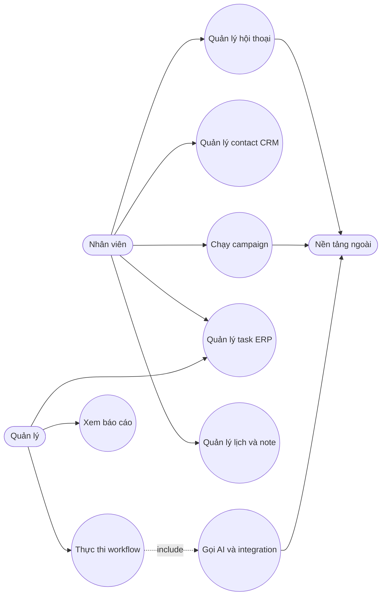

### 14.2 Quản trị hệ thống

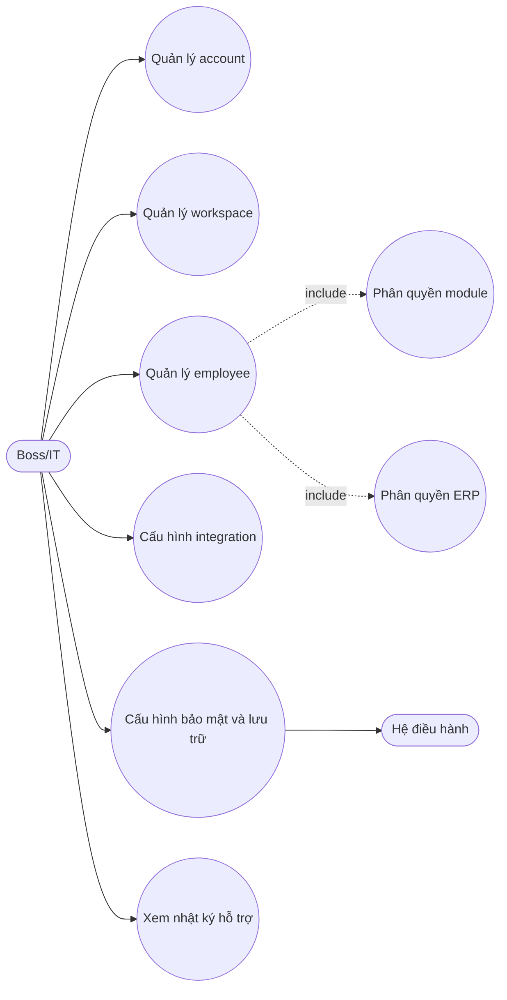

## 15. Sản phẩm BA 10 — Sơ đồ activity

Luồng thực thi một workflow:

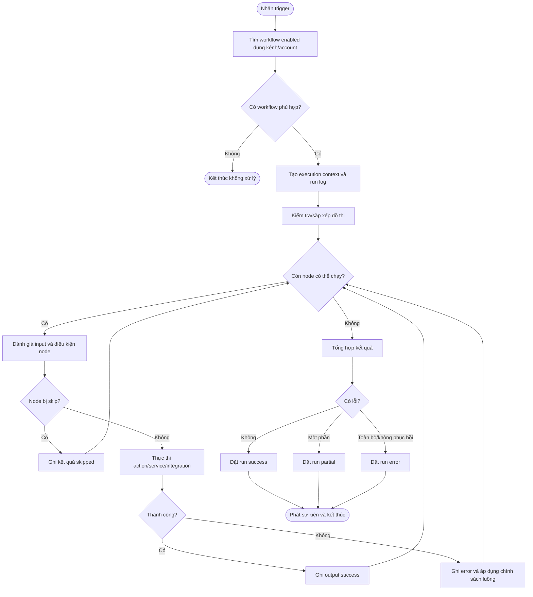

## 16. Sản phẩm BA 11 — Đặc tả use case

### UC-01 — Gửi tin nhắn đa kênh

| Trường | Nội dung |
|---|---|
| Use case name | Gửi tin nhắn đa kênh |
| Use case ID | UC-01 |
| Description | Nhân viên chọn account/thread, soạn nội dung và gửi qua kênh tương ứng |
| Actor | Nhân viên |
| Priority | Cao |
| Trigger | Người dùng nhấn gửi hoặc Enter |
| Pre-condition | Đã đăng nhập; có quyền Chat; account được gán; thread và kênh sẵn sàng |
| Post-condition | Yêu cầu gửi được chuyển tới service; UI/log thể hiện thành công hoặc lỗi |

Business rule: capability tùy kênh; không gửi khi IME đang compose; employee không dùng account chưa được gán. NFR riêng: thao tác không khóa composer quá lâu; lỗi phải chỉ rõ có thể thử lại hay không. **Cần xác nhận vận hành** độ trễ và trạng thái delivery thực tế.

### UC-02 — Chạy campaign CRM

| Trường | Nội dung |
|---|---|
| Use case name | Chạy campaign CRM |
| Use case ID | UC-02 |
| Description | Cấu hình nội dung, contact, delay, giới hạn và xử lý hàng đợi gửi |
| Actor | Nhân viên CRM |
| Priority | Cao |
| Trigger | Người dùng kích hoạt campaign |
| Pre-condition | Có quyền CRM; account/kênh hỗ trợ; campaign có nội dung/contact hợp lệ |
| Post-condition | Contact được gắn trạng thái và send log; campaign done khi không còn pending/sending |

Business rule: tuân thủ delay tối thiểu, giờ bắt đầu và giới hạn ngày; lỗi từng contact không được làm mất log; không coi campaign là công cụ gửi được phép nếu chưa có consent/opt-out. NFR riêng: queue phải phục hồi an toàn sau lỗi và không gửi trùng. **Cần xác nhận vận hành** bằng UAT và stress test.

### UC-03 — Thực thi workflow

| Trường | Nội dung |
|---|---|
| Use case name | Thực thi workflow |
| Use case ID | UC-03 |
| Description | Engine nhận trigger, chạy đồ thị node và ghi run log |
| Actor | Hệ thống/Quản lý workflow |
| Priority | Cao |
| Trigger | Message, schedule, webhook, payment hoặc manual trigger |
| Pre-condition | Workflow enabled, đúng kênh/account, cấu hình node hợp lệ |
| Post-condition | Run có success/error/partial và `node_results`; action ngoài được gọi khi phù hợp |

Business rule: chỉ chạy node reachable theo graph; điều kiện/nhánh quyết định node tiếp theo; secret không được đưa ra renderer/log không cần thiết. NFR riêng: execution phải deterministic với cùng context trừ node ngẫu nhiên/thời gian/API ngoài; cần timeout/retry phù hợp. **Cần xác nhận vận hành** tải đồng thời và idempotency webhook.

### UC-04 — Quản lý task ERP

| Trường | Nội dung |
|---|---|
| Use case name | Quản lý task ERP |
| Use case ID | UC-04 |
| Description | Tạo, phân công, cập nhật trạng thái, cộng tác và hoàn tất task |
| Actor | Owner/Admin/Manager/Member |
| Priority | Cao |
| Trigger | Người dùng tạo hoặc cập nhật task |
| Pre-condition | Có `erp.access` và action permission tương ứng |
| Post-condition | Task và thành phần liên quan được lưu; activity/notification được cập nhật theo service |

Business rule: role và override được kiểm tra phía main; status thuộc tập chuẩn; chỉ actor phù hợp được giao người khác/sửa mọi task/xóa task. NFR riêng: cập nhật phải nhất quán giữa task, assignee, attachment và activity. **Cần xác nhận vận hành** xung đột cập nhật đồng thời.

## 17. Sản phẩm BA 12 — Use scenario

### Scenario A — Nhân viên xử lý học viên mới

Lan mở MaiHub, chọn workspace công ty và tài khoản được phân công. Một học viên gửi câu hỏi qua Zalo; Lan thấy hội thoại mới, đọc lịch sử, dùng mẫu trả lời rồi chỉnh lại cho phù hợp. Lan gắn nhãn “Học viên tiềm năng”, thêm ghi chú và tạo task gọi lại. Học viên nhận được phản hồi, quản lý thấy task và lịch sử xử lý.

### Scenario B — Quản lý chạy chiến dịch nhắc lịch

Minh tạo campaign, chọn đúng tài khoản và danh sách học viên đã đủ điều kiện nhận tin, đặt nội dung cá nhân hóa, khoảng delay, giới hạn/ngày và giờ bắt đầu. Minh xem cảnh báo, kích hoạt rồi theo dõi từng người đang chờ, đang gửi, đã gửi hoặc thất bại. Khi có lỗi, Minh xem log và chỉ thử lại các contact cần thiết.

### Scenario C — Tự động phân loại bằng AI

Quản lý tạo workflow nhận tin nhắn, gửi nội dung tới assistant để phân loại nhu cầu, gắn nhãn CRM và gửi thông báo cho nhóm phụ trách. Khi provider AI lỗi, run log cho biết node lỗi thay vì im lặng; nhân viên vẫn nhận hội thoại để xử lý thủ công.

### Scenario D — Nhân viên remote làm việc qua máy boss

Huy mở workspace remote, đăng nhập bằng tài khoản employee và chỉ thấy module/account được giao. Huy trả lời hội thoại và cập nhật task; yêu cầu được chuyển tới máy boss. Khi mạng gián đoạn, UI hiển thị trạng thái kết nối và không tuyên bố gửi thành công khi chưa có xác nhận. Phần reconnect/offline cần **Cần xác nhận vận hành**.

## 18. Sản phẩm BA 13 — User story và Acceptance Criteria

| User story title | User story | Priority | AC (when, who, how, then) | Note |
|---|---|---|---|---|
| Gửi chat đúng account | Là nhân viên, tôi muốn gửi tin từ account đang chọn để không liên hệ nhầm danh tính | P0 | **When:** đã chọn workspace/account/thread hợp lệ; **Who:** employee có quyền Chat và account assignment; **How:** nhập nội dung và nhấn gửi; **Then:** hệ thống gửi qua đúng channel service và hiển thị kết quả/lỗi | Test Zalo, Facebook, Telegram riêng |
| Quản lý contact | Là nhân viên CRM, tôi muốn gắn tag và note để lưu ngữ cảnh chăm sóc | P1 | **When:** mở contact; **Who:** người có quyền CRM; **How:** thêm tag/note; **Then:** dữ liệu được lưu và hiển thị lại đúng contact/account | Kiểm tra remote workspace |
| Chạy campaign có hàng rào | Là quản lý CRM, tôi muốn đặt delay, giới hạn ngày và giờ bắt đầu để giảm rủi ro gửi dồn | P0 | **When:** campaign hợp lệ; **Who:** người có quyền CRM; **How:** cấu hình và kích hoạt; **Then:** queue không gửi trước giờ/qua giới hạn và ghi trạng thái từng contact | Không thay thế consent/opt-out |
| Thiết kế workflow | Là quản lý, tôi muốn ghép trigger và action để tự động hóa tác vụ lặp lại | P1 | **When:** có account/integration cần thiết; **Who:** người có quyền Workflow; **How:** tạo node/edge và bật workflow; **Then:** trigger phù hợp tạo run log và kết quả node | Validate graph trước bật |
| Xem lỗi workflow | Là người vận hành, tôi muốn thấy node lỗi để khắc phục nhanh | P1 | **When:** một run có lỗi; **Who:** người có quyền Workflow; **How:** mở run log; **Then:** thấy status, error và node result liên quan | Secret phải được redaction |
| Tạo task | Là thành viên ERP, tôi muốn tạo task và gán bản thân để quản lý việc cần làm | P1 | **When:** có quyền `task.create`; **Who:** member trở lên; **How:** nhập tiêu đề và lưu; **Then:** task xuất hiện đúng status/project với activity created | Title là bắt buộc |
| Phân công task | Là quản lý, tôi muốn giao task cho nhân viên để điều phối công việc | P1 | **When:** có quyền `task.assign_others`; **Who:** manager/admin/owner; **How:** chọn assignee; **Then:** task và người nhận được cập nhật/thông báo theo service | UAT notification |
| Phân quyền employee | Là boss, tôi muốn giới hạn module và account để bảo vệ dữ liệu | P0 | **When:** employee tồn tại; **Who:** boss; **How:** chọn permission/account; **Then:** employee chỉ thấy và thao tác trong phạm vi được cấp | Kiểm tra cả UI và IPC |
| Cấu hình integration | Là IT, tôi muốn lưu và test credential để xác nhận kết nối trước dùng | P0 | **When:** mở adapter; **Who:** người được phép quản trị; **How:** nhập credential, lưu, test; **Then:** secret được mask và UI báo kết quả test | safeStorage fallback phải cảnh báo |
| Chuyển workspace | Là người dùng, tôi muốn chuyển không gian làm việc để dữ liệu không trộn lẫn | P0 | **When:** có nhiều workspace; **Who:** người dùng hợp lệ; **How:** chọn workspace; **Then:** DB/store/connection chuyển sang context mới và account active hợp lệ | Stress test chuyển liên tục |
| Khôi phục sau mất mạng | Là nhân viên, tôi muốn biết trạng thái và kết nối lại để không tưởng nhầm tin đã gửi | P0 | **When:** mạng mất rồi phục hồi; **Who:** người dùng đang làm việc; **How:** app health-check/reconnect; **Then:** trạng thái được cập nhật và không gửi trùng | Cần xác nhận vận hành |

## 19. Sản phẩm BA 14 — Yêu cầu phi chức năng

| Nhóm | Yêu cầu/baseline | Hiện trạng bằng chứng | Xác nhận cần có |
|---|---|---|---|
| Xác thực | Tách employee identity, account session và ERP actor | Employee service, WorkspaceManager, ErpAuthContext | UAT hết phiên, đổi mật khẩu, revoke token |
| Phân quyền | Kiểm tra server/main-side cho hành động nhạy cảm, không chỉ ẩn UI | ERP IPC dùng permission guard; module UI có guard | Audit toàn bộ IPC Chat/CRM/Workflow/Integration |
| Secret | Mã hóa bằng OS keychain và mask trên UI | `safeStorage`; credential integration masked | Xử lý plaintext fallback, backup/restore khác máy |
| Renderer security | Cô lập renderer khỏi Node và áp CSP production | `contextIsolation: true`, `nodeIntegration: false`, CSP | Đánh giá `sandbox: false`, CSP broad schemes |
| Webhook | Xác minh chữ ký, giới hạn body/rate, bind interface an toàn | Registry đọc signature nhưng chưa verify trong lớp này | Security test trước public tunnel |
| Audit | Ghi activity/run/send/error cần thiết, redaction secret | Có workflow log, send log, employee message log, ERP activity | Chính sách retention và truy cập log |
| Hiệu suất | Chat/UI không bị khóa bởi I/O; queue có rate control | Async services, queue/token/delay, SQLite WAL | Benchmark startup, sync, 10k+ messages, concurrent workflow |
| Độ tin cậy | Không gửi trùng khi retry/reconnect; không mất draft/log | Có health/reconnect/draft/run log trong mã | Fault injection và crash recovery test |
| Nền tảng | Windows x64, macOS x64/arm64, Linux AppImage/deb theo build config | `package.json` | Test cài đặt và native module trên từng target |
| Responsive | Desktop và mobile-width không overflow/chồng chữ | `useIsMobile`, responsive classes | Screenshot/browser test hai kích thước, dark/light |
| Màu sắc | Logo và UI theo token DESIGN; contrast/focus nhất quán | `DESIGN.md` định nghĩa token light/dark; tương phản được kiểm bằng `src/__tests__/ui/themeTokens.test.ts` | Kiểm tra thực tế từng màn hình cũ chưa rà soát |
| Quốc tế hóa | Nội dung hiện chủ yếu tiếng Việt; format ngày/giờ cần nhất quán | Chuỗi UI nằm trực tiếp trong component | Quyết định locale/timezone và i18n roadmap |
| Dễ sử dụng | Loading/empty/error rõ, cảnh báo thao tác nguy hiểm, phím tắt không xung đột | Có nhiều trạng thái và confirm cục bộ | UAT theo actor, accessibility keyboard/screen reader |
| Backup | Sao lưu DB/config/media trước nâng cấp, có quy trình restore | README nói chưa có backup tự động | Thiết kế backup tự động, mã hóa và diễn tập restore |
| Quan sát | Log đủ chẩn đoán nhưng không lộ credential/cookie/token | Có LogViewer/Logger | Chuẩn log level, rotation, redaction, dung lượng |
| Quyền riêng tư | Không gửi telemetry/backend thượng nguồn theo chủ trương bản nội bộ | README/NOTICE; Tracking/backend bị chặn theo tài liệu | Network inspection bản production |

Không có SLA/latency/tải trọng định lượng được phê duyệt trong repository; các con số phải được owner vận hành xác nhận trước khi trở thành acceptance gate.

## 20. Sản phẩm BA 15 — Quy tắc triển khai và bộ tài liệu dự án

### 20.1 Quy tắc triển khai

1. Phân tích thay đổi, actor, dữ liệu, quyền, migration và rollback trước khi vào sprint.
2. Tách task đủ nhỏ, có độ phức tạp/workload/acceptance criteria và review trước sprint.
3. Hạn chế đổi nghiệp vụ giữa sprint; thay đổi mới đưa vào backlog/sprint sau trừ sự cố P0.
4. Luồng bắt buộc: thay đổi ở dev → test dev → build artifact production → kiểm tra artifact → phát hành artifact; không sửa source trực tiếp trên máy production.
5. BA/UAT ở cuối sprint với dữ liệu đại diện, gồm basic/alternative/exception flow.
6. Thay đổi schema/credential/workspace phải có backup, migration, rollback và diễn tập restore.
7. Thay đổi UI phải kiểm tra desktop/mobile, dark/light, overflow, overlap, keyboard và action chính.
8. Release nội bộ phải ghi version, checksum/kênh phân phối và known issues; không dùng updater thượng nguồn.

### 20.2 Build và phát hành hiện tại

```text
npm install
  -> postinstall patch icon (Windows khi phù hợp)

npm run dev
  -> build bridge E2EE (best effort ở predev)
  -> compile Electron main
  -> chạy Vite + TypeScript watch + Electron

npm run production
  -> build Go bridge E2EE
  -> typecheck/compile Electron production
  -> strip console
  -> Vite build renderer
  -> rebuild better-sqlite3 cho target
  -> electron-builder --publish never
  -> artifact tại dist-electron-build/
```

Target: Windows NSIS/dir x64; macOS dmg/zip x64 và arm64; Linux AppImage/deb. Native `better-sqlite3` phải đúng platform/arch. macOS cần build trên máy Mac; bản hiện chưa ký số theo README/NOTICE. **Cần xác nhận vận hành** quy trình ký, notarization, antivirus/SmartScreen, smoke test và rollback trước phát hành.

### 20.3 Vận hành

- Sao lưu `ahv-connect-tool.db`, config workspace/app và media khi app đã tắt.
- Giám sát dung lượng DB/media/log; định kỳ kiểm tra `PRAGMA integrity_check` trong quy trình bảo trì đã phê duyệt.
- Chỉ dùng tài khoản công việc riêng cho Zalo/Facebook do rủi ro chính sách nền tảng.
- Không public Cloudflare/ngrok/local tunnel khi chưa có xác thực webhook, firewall và giám sát.
- Thu log qua Cài đặt → Nhật ký; redaction credential/cookie/token trước khi chia sẻ.
- Khi nâng cấp, kiểm tra mở DB, đăng nhập kênh, gửi/nhận, campaign nhỏ, workflow mẫu, ERP CRUD và integration test.

### 20.4 Bộ tài liệu dự án phải duy trì

| Tài liệu | Trạng thái/đề xuất |
|---|---|
| Biên bản họp | Lưu quyết định nghiệp vụ, owner và deadline |
| SRS | Dùng tài liệu này làm baseline tổng thể; tách feature spec khi thay đổi lớn |
| URD | Duy trì theo actor/use case/user story đã được stakeholder duyệt |
| BRD | Optional; cần khi mở rộng phạm vi tổ chức/đối tác |
| HDSD | Cần bản theo vai trò Boss/Employee/ERP và quy trình xử lý lỗi |
| Data dictionary | Duy trì cùng migration/schema, không cần sao chép toàn bộ 70+ bảng vào tài liệu tổng thể |
| Runbook vận hành | Backup/restore, release, rollback, log, mất mạng, credential rotation |
| Security checklist | IPC, RBAC, secret, webhook, tunnel, dependency và nền tảng không chính thức |
| Release notes | Version, artifact, checksum, migration, known issues |

## 21. Tích hợp bên ngoài và phụ thuộc quan trọng

| Hệ thống/phụ thuộc | Mục đích | Ranh giới/rủi ro |
|---|---|---|
| Zalo qua `zca-js` | Account cá nhân, chat và CRM actions | Không chính thức/rủi ro khóa tài khoản |
| Facebook Messenger/E2EE | Chat Facebook, E2EE qua Go bridge | API/doc_id có thể đổi; một số bridge method chưa wire |
| Telegram user/bot | Chat và bot integration | Session/token nhạy cảm; rate limit nền tảng |
| OpenAI-compatible providers | AI assistant và workflow AI | Chi phí, quota, dữ liệu gửi ra ngoài |
| Google Sheets | Workflow đọc/ghi sheet | OAuth/credential và quota |
| SMTP/Discord/Notion | Node notification | Secret và giới hạn API |
| KiotViet/Haravan/Sapo/Nhanh/Pancake | POS/e-commerce actions | API contract và credential từng nhà cung cấp |
| Casso/SePay | Transaction/payment webhook | Phải xác minh chữ ký và chống replay |
| GHN/GHTK | Tạo vận đơn/tra cứu | Địa chỉ, phí, token, môi trường sandbox/prod |
| Socket.IO/HTTP relay | Boss–employee | LAN/public exposure, JWT/token, reconnect |
| Electron `safeStorage` | Bảo vệ secret bằng OS | Có fallback plaintext khi không khả dụng/lỗi mã hóa |

### 21.1 Nguồn gốc và giấy phép

- MaiHub là bản nội bộ; mã nguồn cấp repository mang giấy phép MIT và phải giữ thông báo bản quyền/giấy phép khi phân phối. Nguồn: `LICENSE`, `NOTICE.md`.
- `src/bridge-e2ee/bridge/` chứa mã có nguồn từ `meta-messenger.js`, được ghi nhận theo AGPL-3.0; `main.go` và Python wrapper được tài liệu bridge mô tả là mã gốc. Nguồn: `src/bridge-e2ee/README.md`.
- Trước khi phân phối artifact ra ngoài phạm vi nội bộ, cần rà soát nghĩa vụ giấy phép của bridge và toàn bộ dependency đi kèm; tài liệu này không thay thế tư vấn pháp lý.

## 22. Bảo mật và quyền riêng tư

### 22.1 Kiểm soát đã có trong mã

- Single-instance lock, context isolation và tắt Node integration cho renderer.
- CSP production và chặn DevTools/context menu trong production UI.
- `safeStorage` cho setting nhạy cảm và integration credential; UI nhận secret đã mask.
- Mật khẩu employee có trường `password_hash` và service dùng `bcryptjs`.
- ERP actor được suy ra tại main process; `requirePermission` chặn action không hợp lệ.
- SQLite WAL, log nghiệp vụ và tách database theo workspace.
- Tracking và backend thượng nguồn được mô tả là bị chặn trong bản nội bộ.

### 22.2 Rủi ro/việc cần làm

1. `safeStorage` fallback plaintext bảo toàn dữ liệu nhưng giảm bảo mật; cần policy fail-closed hoặc cảnh báo/admin approval cho môi trường thật.
2. Webhook registry chưa tự verify signature, chưa thấy body-size/rate limit tại lớp này.
3. `sandbox: false` và CSP khá rộng; cần threat model renderer compromise.
4. Token/cookie/session tồn tại cục bộ và có thể xuất hiện trong backup/log; cần redaction, permission file và rotation.
5. Public tunnel mở đường vào máy giữ phiên kênh; mặc định vận hành nên tắt.
6. Zalo/Facebook dùng giao thức/thư viện không chính thức, mang rủi ro chính sách và thay đổi API.
7. Bản chưa ký số; cần kênh phân phối và checksum tin cậy.
8. Chưa có backup tự động; mất máy/hỏng DB có thể gây mất dữ liệu.
9. Module permission và ERP permission có hai mô hình khác nhau; cần audit “UI hidden” so với “server denied”.
10. **Cần xác nhận vận hành** bằng network inspection rằng telemetry/backend/updater thượng nguồn thực sự không phát sinh lưu lượng ở artifact production.

## 23. Giới hạn, technical debt và điểm chưa xác nhận

| ID | Nội dung | Tác động | Khuyến nghị |
|---|---|---|---|
| TD-01 | README/NOTICE không khớp mã về daily limit/start time | Vận hành hiểu sai hàng rào campaign | Cập nhật tài liệu và UAT queue |
| TD-02 | Chưa có opt-out/consent thống nhất và `daily_start_time` không phải quiet-hours | Rủi ro spam/tuân thủ | Thiết kế consent/suppression/quiet-hours trước gửi thật |
| TD-03 | Signature webhook chỉ được thu thập ở registry | Giả mạo/replay webhook | Verify theo adapter, timestamp/nonce, body limit |
| TD-04 | `safeStorage` fallback plaintext | Lộ secret khi OS encryption lỗi | Cảnh báo rõ hoặc fail-closed theo policy |
| TD-05 | Không có backup tự động | Mất dữ liệu | Backup có mã hóa + restore drill |
| TD-06 | API Zalo/Facebook không chính thức | Khóa tài khoản/gián đoạn | Tài khoản công việc, canary và runbook |
| TD-07 | Build chưa ký số | Cảnh báo OS, supply-chain trust thấp | Signing/notarization và checksum |
| TD-08 | Đã xử lý 02/10/2026: `DESIGN.md` là hệ thiết kế của toàn UI | Màn hình cũ có thể còn chỗ chưa theo token | Rà soát dần từng màn hình khi sửa |
| TD-09 | `ALL_MODULES` và guard view ERP/settings chưa hoàn toàn đồng nhất | Quyền khó hiểu | Hợp nhất vocabulary và audit IPC |
| TD-10 | Workspace cap 5 là hằng số | Giới hạn mở rộng | Chỉ nâng khi có nhu cầu và test tài nguyên |
| TD-11 | Một số method E2EE có trong bridge nhưng chưa wire qua entrypoint | Capability Facebook không đầy đủ | Chỉ wire khi có use case và test E2EE |
| TD-12 | Đã xử lý 02/10/2026: có `npm test` (jest); ts-jest chỉ chuyển mã, type-check do `tsc --noEmit` | Lỗi kiểu trong file test chỉ bị bắt bởi `tsc`, không bởi jest | Luôn chạy cả `tsc --noEmit` và `npm test` trước khi merge |
| TD-13 | Chưa có SLA/performance baseline | Không thể kết luận tải tối đa | Benchmark theo dataset/workspace thực |
| TD-14 | Di trú dữ liệu → MaiHub là thủ công | Rủi ro thao tác sai | Runbook, backup và dry-run trên từng OS |
| TD-15 | UI campaign có preset delay 5–15 giây nhưng queue ép tối thiểu 30 giây | Người vận hành hiểu sai nhịp gửi thực tế | Đồng bộ validation/preset với `MIN_DELAY_MS` hoặc hiển thị rõ delay hiệu lực |

## 24. Traceability

### 24.1 Ma trận yêu cầu–mã nguồn

| Trace | Năng lực/claim | Nguồn repo-relative |
|---|---|---|
| ARCH-01 | Electron window, CSP, startup, workspace ordering | `electron/main.ts` |
| ARCH-02 | Hợp đồng renderer–main | `electron/preload.ts`, `electron/ipc/` |
| ARCH-03 | Điều hướng/module UI | `src/ui/App.tsx`, `src/ui/components/layout/Sidebar.tsx` |
| DATA-01 | SQLite schema và WAL | `src/services/database/DatabaseService.ts` |
| WS-01 | Local/remote workspace, cap 5, DB path | `src/utils/WorkspaceManager.ts` |
| AUTH-01 | Standalone/boss/employee | `src/utils/AppModeManager.ts` |
| EMP-01 | Employee module model | `src/models/employee.ts`, `src/services/employee/EmployeeService.ts` |
| ERP-01 | ERP RBAC/override/main-side actor | `src/services/erp/permissions.ts`, `src/services/erp/ErpAuthContext.ts` |
| ERP-02 | Task/project/HRM state và input | `src/models/erp/Task.ts`, `src/models/erp/Project.ts`, `src/models/erp/Hrm.ts` |
| CRM-01 | Campaign/contact status và limit fields | `src/models/crm.ts` |
| CRM-02 | Queue, daily limit/start time, completion | `src/services/crm/CRMQueueService.ts` |
| WF-01 | Node types, execution và run results | `src/services/workflow/WorkflowEngineService.ts`, `src/models/workflow.ts` |
| INT-01 | Adapter registry, encryption/masking, webhook | `src/services/integrations/IntegrationRegistry.ts`, `src/services/integrations/adapters/` |
| SEC-01 | Secure settings và plaintext fallback | `src/services/secure/SecureSettingsService.ts` |
| UI-01 | Campaign form | `src/ui/components/crm/campaigns/CampaignCreateModal.tsx` |
| UI-02 | Workflow editor | `src/ui/components/workflow/WorkflowEditor.tsx` |
| UI-03 | Task editor | `src/ui/features/erp/tasks/TaskEditorDrawer.tsx` |
| UI-04 | Integration config | `src/ui/components/integration/IntegrationPage.tsx`, `src/ui/components/integration/IntegrationDetailPage.tsx` |
| UI-05 | Workspace/employee settings | `src/ui/components/settings/WorkspaceSettings.tsx`, `src/ui/components/settings/EmployeeSettings.tsx` |
| FB-01 | Go E2EE bridge/protocol | `src/bridge-e2ee/README.md`, `src/bridge-e2ee/main.go` |
| BUILD-01 | Runtime dependencies, scripts, targets | `package.json` |
| OPS-01 | Internal-use warnings, data/build notes | `README.md`, `NOTICE.md` |
| BRAND-01 | Logo và hệ thiết kế giao diện (token, lý do) | `DESIGN.md` |
| LEGAL-01 | Nguồn gốc và giấy phép MIT/AGPL của bridge | `LICENSE`, `NOTICE.md`, `src/bridge-e2ee/README.md` |

### 24.2 Ma trận BA deliverable

| # | Sản phẩm | Vị trí |
|---:|---|---|
| 1 | BPMN | Mục 6 |
| 2 | Swimlane workflow | Mục 7 |
| 3 | State diagram | Mục 8 |
| 4 | Danh sách chức năng | Mục 9 |
| 5 | Ma trận phân quyền | Mục 10 |
| 6 | UX + phân tích thiết kế | Mục 11 |
| 7 | Screen specs có bảng trường | Mục 12 |
| 8 | Sitemap | Mục 13 |
| 9 | Use case diagram | Mục 14 |
| 10 | Activity diagram | Mục 15 |
| 11 | Use case specs | Mục 16 |
| 12 | Use scenarios | Mục 17 |
| 13 | User stories + AC when/who/how/then | Mục 18 |
| 14 | NFR | Mục 19 |
| 15 | Quy tắc triển khai + bộ tài liệu | Mục 20 |

## 25. Nguồn tham chiếu

- Tổng quan và cảnh báo nội bộ: `README.md`, `NOTICE.md`.
- Nhận diện logo: `DESIGN.md`, `resources/icons/icon.svg`.
- Runtime/build/dependencies: `package.json`, `electron/main.ts`, `electron/preload.ts`.
- IPC domain: `electron/ipc/`.
- Model: `src/models/`.
- Business services: `src/services/`.
- Workspace/app mode: `src/utils/WorkspaceManager.ts`, `src/utils/AppModeManager.ts`.
- Renderer: `src/ui/App.tsx`, `src/ui/components/`, `src/ui/features/`, `src/ui/store/`.
- Facebook E2EE bridge: `src/bridge-e2ee/README.md`, `src/bridge-e2ee/main.go`.

## 26. Checklist xác nhận vận hành trước khi dùng thật

- [ ] Cài và smoke-test artifact trên từng OS/architecture được phát hành.
- [ ] Xác nhận DB/media/config path, backup và restore.
- [ ] Kiểm tra đăng nhập, reconnect, revoke và logout mọi kênh.
- [ ] Kiểm tra module permission, account assignment và toàn bộ ERP action/override.
- [ ] Kiểm tra campaign với danh sách test: delay, giờ bắt đầu, giới hạn ngày, pause/resume, retry và không gửi trùng.
- [ ] Phê duyệt consent, opt-out, suppression list và quiet-hours trước campaign thật.
- [ ] Kiểm tra workflow manual/schedule/message/webhook/payment, timeout, partial/error log và redaction.
- [ ] Xác minh webhook signature, replay protection, body/rate limit và bind/tunnel.
- [ ] Network-inspect artifact để xác nhận không telemetry/updater/backend thượng nguồn.
- [ ] Kiểm tra desktop/mobile, dark/light, overflow, overlap, focus, keyboard và screen reader cơ bản.
- [ ] Benchmark với dữ liệu đại diện và xác lập SLA/SLO.
- [ ] Ký/notarize hoặc ban hành checksum và kênh phân phối nội bộ tin cậy.

---

Tài liệu này là snapshot theo mã nguồn. Khi schema, permission, IPC, workflow node, adapter hoặc quy trình release thay đổi, phải cập nhật traceability và các mục BA liên quan trong cùng thay đổi.
